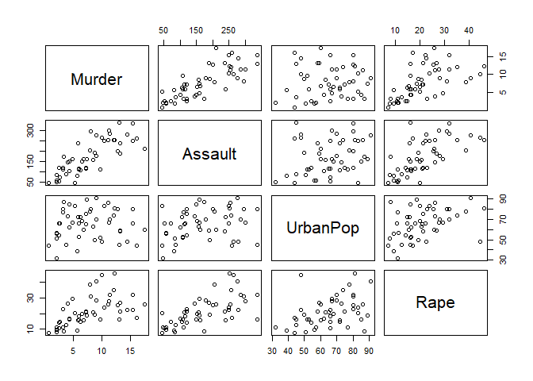

Programming Background
================
Damon D’Ambrosio
2023-06-06

## Response to prompt

I had a little exposure to R through grad school, but mostly coded in
SAS. I was largely self-taught in both of these languages. Regarding R,
I always felt it was more “fragmented,” and hard to keep things
organized. After some proper education in R, I see that this feeling was
largely an artifact of poor technique on my part (e.g., poor project
management, poor naming conventions for objects, not knowing how to
write functions, not knowing the “theory” behind packages and
functions). R is a very nice programming language. Now that I am more
knowledgable on good technique, I find working with R to be much more
enjoyable. R, especially with `tidyverse`, seems a lot more
straightforward when it comes to data handling compared to SAS. One
advantage I felt SAS had was reconstructing a prior analysis; I found it
easier to read through existing SAS code to figure out what was done in
the past. After learning about RMarkdown, I see that R can offer
comparable (arguably superior) functionality in this regard. While I
have hit a few snags with my learning here and there, I do not find R to
be an overall difficult language to learn.

## R Markdown Output

``` r
plot(USArrests)
```

<!-- -->
